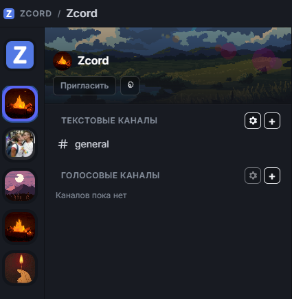
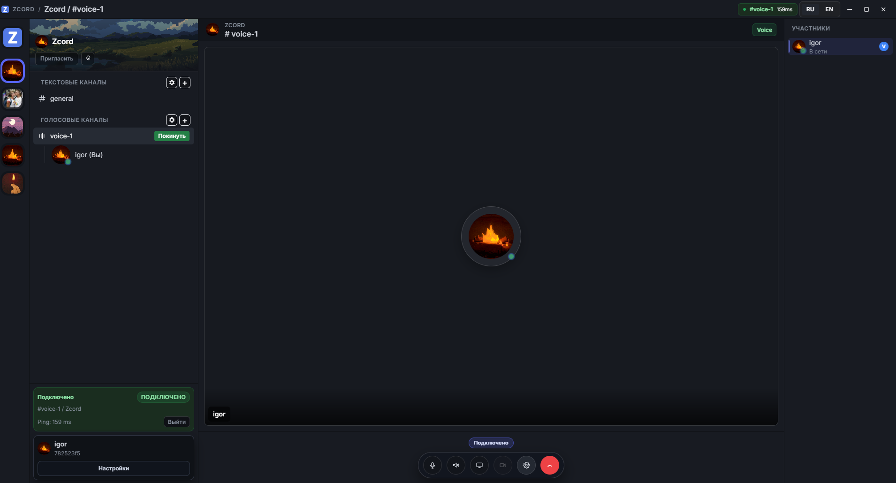

# zcord

  <strong>Modern desktop communication for teams, communities, and creators.</strong> 
  Realtime chat, voice, calls, and screen sharing in one focused dark interface.

  
  
  
  
  
  

## Product Vision

zcord is built as a desktop-native communication hub: quick to open, predictable in behavior, and stable under realtime load.  
It combines the workflows users expect every day: channel chat, direct messages, voice presence, DM calling, and screen sharing.

## Preview

  
  

## What Makes zcord Different

- Realtime-first architecture: low-latency state sync for chat, presence, and calls
- Desktop UX focus: clean dark UI, readable typography, low visual noise
- Voice-ready stack: WebRTC signaling with STUN/TURN support
- Security-minded core: hardened auth and constrained runtime boundaries
- Fast release loop: in-app update pipeline for desktop clients

## Core Capabilities

### Messaging
- Instant delivery through WebSocket gateway
- Reply, edit, delete, forward, and read-state flows
- Media-aware messaging with upload pipeline

### Voice and Calls
- Voice channel presence and participant state sync
- DM call lifecycle: incoming, active, reconnect, leave
- Screen share controls and participant-side stream handling

### Desktop Experience
- Electron shell with isolated renderer context
- Native notifications and call UI surfaces
- In-app updates: check, download, install, restart

## Architecture

- `client/` - Electron + React desktop application
- `backend/` - FastAPI REST + WebSocket services
- `postgres` - persistent relational store
- `redis` - ephemeral presence/state helpers
- `minio` - media and attachment storage
- `nginx` - reverse proxy and TLS edge

This split keeps chat, media, auth, and call transport independently evolvable.

## Technology

| Layer | Technologies |
|---|---|
| Desktop | Electron, React, TypeScript, Vite, Tailwind, Framer Motion |
| Backend | FastAPI, Pydantic, SQLAlchemy, Alembic |
| Realtime | WebSocket gateway + event routing |
| Data | PostgreSQL, Redis, MinIO |
| Infra | Docker Compose, Nginx |

## Security Posture

- Argon2id password hashing
- RS256 token strategy with refresh rotation
- Upload validation and payload boundaries
- API/WebSocket rate limiting
- Restricted IPC bridge and isolated renderer runtime

## Repository Structure

- `client/` - desktop app and UI layer
- `backend/` - API, auth, realtime, data services
- `secrets/` - local-only placeholder mount point
- `certs/` - local-only placeholder mount point
- `.github/workflows/` - CI/CD and release automation

## Development Direction

- Improve call reliability under reconnect and route changes
- Reach visual parity across chat/voice/settings surfaces
- Expand moderation and server management controls
- Strengthen diagnostics for production operations

---

<strong>zcord is under active development.</strong>

